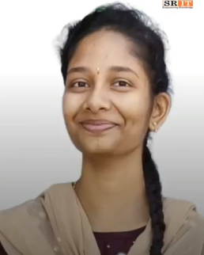

<!doctype html>
<html lang="en">

<head>
    <!-- Required meta tags -->
    <meta charset="UTF-8">
    <meta name="description" content="">
    <meta name="keywords" content="HTML,CSS,XML,JavaScript">
    <meta name="author" content="Ecology Theme">
    <meta name="viewport" content="width=device-width, initial-scale=1.0">
    <title>SRIT</title>
    <link rel="shortcut icon" href="images/favicon.ico" type="image/x-icon">
    <!-- Goole Font -->
    <link href="https://fonts.googleapis.com/css?family=Rubik:400,500,700" rel="stylesheet">
    <link href="https://fonts.googleapis.com/css?family=Poppins:300,400,500,600,700" rel="stylesheet"> 
    <link href="https://fonts.googleapis.com/css?family=Roboto:400,500,700,900" rel="stylesheet">
    <!-- Bootstrap CSS -->
    <link rel="stylesheet" href="css/assets/bootstrap.min.css">
    <!-- Font awsome CSS -->
    <link rel="stylesheet" href="css/assets/font-awesome.min.css">    
    <link rel="stylesheet" href="css/assets/flaticon.css">
    <link rel="stylesheet" href="css/assets/magnific-popup.css">    
    <!-- owl carousel -->
    <link rel="stylesheet" href="css/assets/owl.carousel.css">
    <link rel="stylesheet" href="css/assets/owl.theme.css">     
    <link rel="stylesheet" href="css/assets/animate.css"> 
    <!-- Slick Carousel -->
    <link rel="stylesheet" href="css/assets/slick.css">  
    <link rel="stylesheet" href="css/assets/preloader.css"/>    

    <!-- Revolution Slider -->
    <link rel="stylesheet" href="css/assets/revolution/layers.css">
    <link rel="stylesheet" href="css/assets/revolution/navigation.css">
    <link rel="stylesheet" href="css/assets/revolution/settings.css">    
    <!-- Mean Menu-->
    <link rel="stylesheet" href="css/assets/meanmenu.css">
    <!-- main style-->
    <link rel="stylesheet" href="css/style.css">    
    <link rel="stylesheet" href="css/responsive.css">
    <link rel="stylesheet" href="css/demo.css">
    <!-- HTML5 shim and Respond.js IE8 support of HTML5 elements and media queries -->
    <!-- WARNING: Respond.js doesn't work if you view the page via file:// -->
    <!--[if lt IE 9]>
      
      
    <![endif]-->
</head>
<body>
<header class="header_four">
<!-- Preloader -->

    
&nbsp;

    
    

        

            

                

                    

                        
                   
        					<ul class="list-unstyled">
                                <li><i class="flaticon-phone-receiver"></i>+91-9515611111</li>
        						<li><i class="flaticon-mail-black-envelope-symbol"></i>hr@srit.ac.in</li>
        					</ul>                    
                        

                        

                             <ul class="d-flex">
                                <li class="nav-item"><a href="https://webprosindia.com/sritstudent/" class="nav-link sign-in js-modal-show"><i class="flaticon-user-male-black-shape-with-plus-sign"></i>Student Login</a></li>
                                <li class="nav-item"><a href="https://webprosindia.com/srit/" class="nav-link join_now js-modal-show"><i class="flaticon-padlock"></i>Faculty Login</a></li>
                                <li class="nav-item"><a href="https://www.srit.ac.in/degreeverification" class="nav-link join_now js-modal-show"><i class="flaticon-padlock"></i>Degree Verification</a></li>
                                <li class="nav-item"><a href="https://alumni.srit.ac.in/" class="nav-link join_now js-modal-show"><i class="flaticon-padlock"></i>Alumini</a></li>
                                <li class="nav-item"><a href="https://clubsatsrit.in/login.php" class="nav-link join_now js-modal-show"><i class="flaticon-padlock"></i>Clubs At SRIT</a></li>

                            </ul>
                            <a href="contact.html" title="" class="apply_btn">Contact Us</a>
                        

                    

                

            

        

    

    

        

            <nav class="navbar navbar-expand-md navbar-light bg-faded">
                
                

                    <ul class="navbar-nav nav lavalamp ml-auto menu">
                        <li class="nav-item"><a href="#" class="nav-link active">Home</a>

                        </li>
                        <li class="nav-item"><a href="about.html" class="nav-link">About Us</a></li>
                        <li class="nav-item"><a href="course.html" class="nav-link">Departments</a>
                            <ul class="navbar-nav nav mx-auto">
                                <li class="nav-item"><a href="course.html" class="nav-link">CSE</a></li>
                                <li class="nav-item"><a href="course-details.html" class="nav-link">CSE( AI & ML )</a></li>
                                <li class="nav-item"><a href="course-details.html" class="nav-link">CSE( Data Science )</a></li>
                                <li class="nav-item"><a href="course-details.html" class="nav-link">ECE</a></li>
                                <li class="nav-item"><a href="course-details.html" class="nav-link">EEE</a></li>
                                <li class="nav-item"><a href="course-details.html" class="nav-link">MECH</a></li>
                                <li class="nav-item"><a href="course-details.html" class="nav-link">CIVIL</a></li>
                                <li class="nav-item"><a href="course-details.html" class="nav-link">H&S</a></li>

                            </ul> 
                        </li>

                    <li class="nav-item"><a href="#" class="nav-link">Campus Life</a>
                        <ul class="navbar-nav nav mx-auto">
                            <li class="nav-item"><a href="campus.html" class="nav-link">Campus</a></li>
                            <li class="nav-item"><a href="cafeteria.html" class="nav-link">Cafeteria</a></li>
                            <li class="nav-item"><a href="classrooms.html" class="nav-link">Class Rooms</a></li>
                            <li class="nav-item"><a href="labs.html" class="nav-link">Labs</a></li>
                            <li class="nav-item"><a href="hostel.html" class="nav-link">Hostel</a></li>
                            <li class="nav-item"><a href="buses.html" class="nav-link">Transportation</a></li>
                            <li class="nav-item"><a href="internet.html" class="nav-link">Internet</a></li>

                        </ul> 
                    </li>
                        <li class="nav-item"><a href="blog.html" class="nav-link">Student Chapters</a>
                            <ul class="navbar-nav nav mx-auto">
                                <li class="nav-item"><a href="blog.html" class="nav-link">IEI</a></li> 
                                <li class="nav-item"><a href="blog-2.html" class="nav-link">CSM McCarthy Innovation Club</a></li> 

                                <li class="nav-item"><a href="blog-2.html" class="nav-link">INTERNET SOCIETY</a></li> 
                                <li class="nav-item"><a href="blog-3.html" class="nav-link">TOASTMASTERS INERNATIONAL CLUB</a></li>
                                <li class="nav-item"><a href="blog-3.html" class="nav-link">NDLI CLUB</a></li>
                                <li class="nav-item"><a href="blog-3.html" class="nav-link">PROGRAMMERS CLUB</a></li>
                                <li class="nav-item"><a href="blog-3.html" class="nav-link">ENGLISH LANGUAGE CLUB</a></li>
                                <li class="nav-item"><a href="blog-3.html" class="nav-link">ICI</a></li>
                                <li class="nav-item"><a href="blog-3.html" class="nav-link">GAZE</a></li>

                                <li class="nav-item"></li>
                            </ul> 
                        </li>
                        <li class="nav-item"><a href="committe.html" class="nav-link">Committies</a> </li>
                        <li class="nav-item"></li>

            </nav><!-- END NAVBAR -->
        
 
    

    <!--==================
        Slider
    ===================-->
    

        

            <ul>
                <li data-index="rs-1706" data-transition="fade" data-slotamount="7" data-hideafterloop="0" data-hideslideonmobile="off"  data-easein="default" data-easeout="default" data-masterspeed="1000"  data-rotate="0"  data-saveperformance="off"  data-title="Slide" data-param1="" data-param2="" data-param3="" data-param4="" data-param5="" data-param6="" data-param7="" data-param8="" data-param9="" data-param10="" data-description="">

                    

                    <!-- SLIDE'S MAIN BACKGROUND IMAGE -->
                    
                    <!-- LAYER NR. 1 -->
                    
An Education is an investment in your Future
                    

                    <!-- LAYER NR. 2 -->
                    
Start Your Journey With SRIT
                    

                    <!-- LAYER NR.3 -->
                    
Admissions for 2025
                    

                    <!-- LAYER NR. 4 -->
                    
KNOW MORE</a>
                    

                    <!-- LAYER NR. 5 -->

                </li>

                <li data-index="rs-1708" data-transition="fade" data-slotamount="7" data-hideafterloop="0" data-hideslideonmobile="off"  data-easein="default" data-easeout="default" data-masterspeed="1000"  data-rotate="0"  data-saveperformance="off"  data-title="Slide" data-param1="" data-param2="" data-param3="" data-param4="" data-param5="" data-param6="" data-param7="" data-param8="" data-param9="" data-param10="" data-description="">
                    

                    
                    <!-- LAYER NR. 1 -->
                    
The Goal Of Education Is The Advancement Of Knowledge
                    

                    <!-- LAYER NR. 2 -->
                    
Start your journey with SRIT
                    

                    <!-- LAYER NR.3 -->
                    
Admissions for 2025
                    

                        <!-- LAYER NR. 4 -->
                    
 KNOW MORE
                    

                        <!-- LAYER NR. 5 -->

                </li>

            </ul><!-- END SLIDES LIST -->
        
<!-- END SLIDER CONTAINER -->
    
<!-- END SLIDER CONTAINER WRAPPER -->
</header> <!--  End header section-->

<section class="cources_highlight">
    

        

            

                

                     

                        

                            
                        

                        

                            look At  
                            <h3><a href="#" title="">Courses Offered</a></h3> 
                            
SRIT's mission is to provide majority of courses.."fill matter"
                    
                        
   
                    

                    

                        

                            
                        

                        

                            Go To  
                            <h3><a href="#" title="">Admissions and Fee Structure</a></h3> 
                            
SRIT's mission is to provide majority of courses.."fill matter"
                    
                        
   
                    

                   

                        

                            
                        

                        

                            Join by  
                            <h3><a href="#" title="">Scholorships</a></h3> 
                             
SRIT's mission is to provide majority of courses.."fill matter
  
                        
   
                    

                

            
             
        

    

</section><!-- End Popular Courses Highlight -->

<section class="about_top_wrapper">
    
            
        

            

                

                    <h2>Welcome_to_SRIT</h2>
                    
This Society was established by Founder-cum-Secretary Sri Aluru Sambasiva Reddy in November 2007 in memory of his mother, Late Smt. Aluru Narayanamma, to give shape to his firm belief that “EDUCATION IS A KEY ENABLER FOR PROGRESS”. This belief has shaped his entire life – he himself excelled in his scholastic years and then became a tutor, teaching students not only his subject but also imparting higher human values. As his career progressed, he wanted to ensure that maximum students from rural and developing areas could derive benefit from this credo.

                 

            

        

    

    
            
        

            

                

                    
                 

            

        

    

    

    

        
            
            

                

                    

                        
                     

                

                

                    

                        <h2>Vision</h2>
                        
To become a premier Educational Institution in India offering the best teaching and learning environment for our students that will enable them to become complete individuals with professional competency, human touch, ethical values, service motto, and a strong sense of responsibility towards environment and society at large.

                     

                

            

        

    

</section><!-- End about_top_wrapper -->

<section class="events-area">
    

        

            

                
  
                    

                        <h2>Events</h2>
                        
events organized by departments "fill this"
  
                    
<!-- ends: .section-header -->
                    

                        <a href="#" title="">View All</a>
                    

                
 
            

        

        

            

                

                    

                        
                    

                    

                        <h3><a href="#" title="">Three-day Cyber Security Awareness Program for rural schools</a></h3>
                        

                            <i class="flaticon-clock-circular-outline"></i>9.30 Am - 4.30 Pm
                            <i class="fas fa-map-marker-alt"></i>B BLock Seminar Hall
                        

                        
The culminating event of the three-day Cyber Security Awareness Program, focusing on "Awareness and Exploration of Cyber Security in Rural Schools of Anantapuramu District," hosted by SRIT marked the conclusion of a sponsored project from NCSTC. Supported by the National Council for Science and Technology, Department of Science and Technology, Government of India, the program commenced on 04-03-2024, witnessing active participation from both school students and faculty until its conclusion on 06-03-2024.

                        

                            04
                            March
                        

                    

                
  
            

            

                

                    

                        <h3><a href="#" title="">Awareness program titled "Crack Your Core Career"</a></h3>
                        

                            <i class="flaticon-clock-circular-outline"></i>10.00 Am - 1.00 Pm
                            <i class="fas fa-map-marker-alt"></i>B BLock Seminar Hall
                        

                         
The Electrical and Electronics Engineering (EEE) department organized an awareness program titled "Crack Your Core Career" for third-year EEE and MEC students. The session, conducted by Mr. K Madan Mohan, Founder & CEO of Hyderabad Institute of Electrical Engineers (HIEE), aimed to enlighten students about core career prospects. Mr. Mohan shared valuable insights and guidance to empower students in making informed decisions for their future in the field. The event was a significant step towards bridging the gap between academic learning and real-world career opportunities. 

                    

                    

                        
                    

                    

                        11
                        March
                    

                
  
            

            

                

                    

                        
                    

                    

                        <h3><a href="#" title="">Mini Project Expo by Department of CSE</a></h3>
                        

                            <i class="flaticon-clock-circular-outline"></i>8.00 Am - 5.00 Pm
                            <i class="fas fa-map-marker-alt"></i>B BLock Seminar Hall
                        

                         
Today's Mini Project Expo goes beyond showcasing projects; it's a celebration of innovation and collaboration in our department. Students will witness a diverse range of projects spanning Computer Science and Engineering domains. Each project represents dedication and hard work, addressing real-world problems with technological solutions. It's a testament to our students' commitment to excellence and their readiness to make a difference in the tech world.

                        

                            15
                            March
                        

                    

                
  
            
            

        

    

</section><!-- ./ End Events Area section -->
<h1 style="padding-left: 35%;"><b>Placements information </h1>
<iframe src="placements.html" width="100%" height="1500px" style="border: none;"></iframe>

<section class="out_count_student">
    

        

            

                

                    <h2>SRIT "fill matter" </h2>
                    
" fill matter....'".
  
                
<!-- ends: .section-header -->
            

        

        

            

                

                    

                        

                            
3000 +

                            Active students
                        

                    

                    

                        

                            
200 +

                            Faculty
                        
  
                    
  

                    

                        

                            
80 %

                            Placements
                        

                    

                    

                        

                            
90 %

                            Graduates
                        
  
                    
 
                
 
            

        

    

    

        
    

</section>

<section class="testimonial">
    

        

            

                

                    <h2>students Say About Us.</h2>
                

            

            

                

                    

                        

                            

                                
As being a student from the Department of Mechanical Engineering. I've secured a job in ECAF Bank with a package of 3LPA. I strongly believe that the branch you choose doesn't stop you from getting into any other industry

                            

                        

                        

                            

                                
I secured job as Programmer Analyst in Cognizant Technology Solutions with a package of 5.5LPA and smashes misconceptions about career choices. Success is in the hard work, not just the branch you choose.

                            

                        

                        

                            

                                
I secured job  in Sapiens Technologies as Test Analyst with an impressive package of 5.15 LPA. My hard work and dedication have paid off, and I could be prouder of this achievement. 

                            

                        

                    
 
                    

                        

                            

                                
                                

                                    Vasu
                                    Mechanical Student
                                

                            
                    
                            

                                
                                

                                    Bheemasena Reddy
                                    EEE Student
                                

                            
                    
                            

                                
                                

                                    Naimisha
                                    ECE Student
                                

                            
                    
                        

                    

                

            

        

    

</section><!-- End Testimonial -->

<section class="blog">
    

        

            

                

                    <h2>Faclilities</h2>
                    
Lorem ipsum dolor sit amet mollis felis dapibus arcu donec viverra. Pede phasellus eget. Etiam maecenas vel vici quis dictum rutrum nec nisi et.
  
                
<!-- ends: .section-header -->
            

            

                 

                    

                        
                    

                    

                        Sports  
                        <h3><a href="#" title="">Sport is an integral part of the curriculum</a></h3> 
             
                    
   
                

            

            

                

                     

                        
                    

                    

                        Central Library  
                        <h3><a href="#" title="">Students read together.."fill"</a></h3> 
              
                    
   
                

            

            

               

                     

                        
                    

                    

                        Transportation  
                        <h3><a href="buses.html" title="">The institution runs 29 buses covering all the important localities.</a></h3> 
              
                    
   
                

            

        

    

</section><!-- End Blog  -->

<!-- chatbot  -->

<section class="our_sponsor">
    

        

            

                

                    <h2>Industry_Partners_For_Placements</h2>
                    
Equipping the students by imparting quality training to meet the expectations of the industry by striving continuously for excellence and promoting them with the ethical and human values.
  
                
<!-- ends: .section-header -->
            

            

                <ul class="sponsored_company_logos">
                    <li> </li>
                    <li></li>
                    <li></li>
                    <li></li>
                    <li></li>
                </ul>
                <ul class="sponsored_company_logos sponsored_company_logos_2">
                    <li></li>
                    <li></li>
                    <li></li>
                    <li></li>
                    <li></li>

                </ul>
            
            
        

    

</section><!-- ./ End Our Sponsor -->

<footer>
    

        

            

                

                     
                    
                
   
            

            

                

                    

                        <h2>Become A Instructor</h2>
                        
Lorem ipsum dolor sit amet mollis felis dapibus arcu donec viverra. Pede phasellus eget. Etiam maecenas vel vici quis dictum rutrum nec nisi et.
  
                    
<!-- ends: .section-header -->
                    

                        <a href="#" title="">Get Started Now</a>
                    

                     
                
                                
            

        

        

            

                

                    

                        
                        
Ante amet vitae vulputate odio nulla vel pretium pulvinar aenean. Rhoncus eget adipiscing etiam arcu. Ultricies justo ipsum nec amet.

                    

                

                

                    

                        <h3>Departments</h3>
                        <ul class="location_info quick_inf0">
                            <li><a href="#">Computer Science Engineering (CSE)</a></li>
                            <li><a href="#">Computer Science Engineering- AI & ML (CSM)</a></li>
                            <li><a href="#">Computer Science and Engineering - Data Science (CSD)</a></li>
                            <li><a href="#">Electronics and Communications Engineering (ECE)</a></li>
                            <li><a href="#">Electrical and Electronics Engineering (EEE)</a></li>
                            <li><a href="#">Mechanical Engineering(MEC)</a></li>
                            <li><a href="#">Civil Engineering (CIV)</a></li>

                        </ul>                         
                    

                

                

                    

                        <h3>information</h3>
                        <ul class="quick_inf0">
                            <li><a href="#">Chairperson</a></li>
                            <li><a href="#">Secretary</a></li>
                            <li><a href="#">Principal</a></li>
                            <li><a href="#">Governing Council</a></li>
                            <li><a href="#">Academic Council</a></li>
                        </ul>
                    

                

                

                    

                        <h3>Contact Us</h3>
                        
Feel free to get in touch us via Phone or send us a message.

                        

                            +91-9515611111 
                            hr@srit.ac.in
                        

                        <ul class="social_items d-flex list-unstyled">
                            <li><a href="https://www.facebook.com/sritatp"><i class="fab fa-facebook-f fb-icon"></i></a></li>
                            <li><a href="https://twitter.com/sritatp"><i class="fab fa-twitter twitt-icon"></i></a></li>
                            <li><a href="https://www.linkedin.com/school/sritatp/"><i class="fab fa-linkedin-in link-icon"></i></a></li>
                            <li><a href="https://www.instagram.com/sritatp/"><i class="fab fa-instagram ins-icon"></i></a></li>
                        </ul>
                    

                

            

        

    

    

         
         
         
         
         
        
    

    
</footer><!-- End Footer -->

<section id="scroll-top" class="scroll-top">
    <h2 class="disabled">Scroll to top</h2>
    

        <a href="#"><i class = "flaticon-right-arrow"></i></a>
    

</section>

    <!-- JavaScript -->
    
    
    
    <!-- Revolution Slider -->
    
     
         
       
       
      
    <!-- Counter Script -->
    
        
     
    <!-- Revolution Extensions -->
    
    
    
    
    
    
    
    
    
    
     

    <!-- =========================================================
         STYLE SWITCHER | ONLY FOR DEMO NOT INCLUDED IN MAIN FILES
    ============================================================== -->

</body>

</html>
